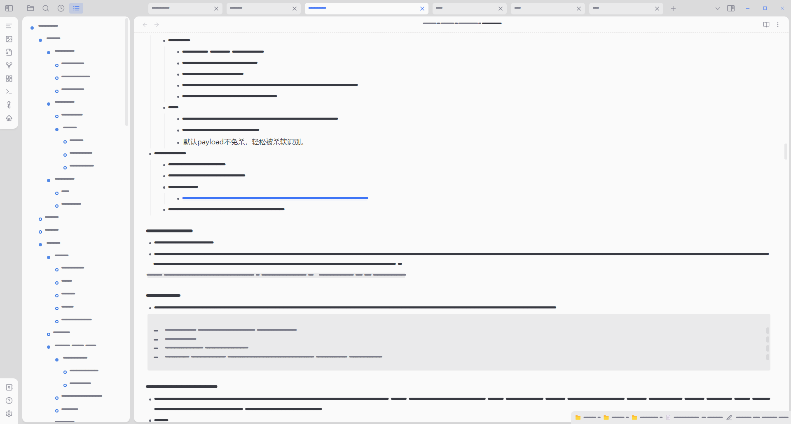

# Garble Text

## 原项目 Original repository

感谢kurakart的精彩分享

Thanks to kurakart for his wonderful sharing

https://github.com/kurakart/garble-text

## 改进点 Modified content

由于原始仓库停止更新，为了方便自己使用，我更新了部分插件功能：

Since the original repository is no longer updated, I have updated some of the plugin features for your own convenience:

- 添加侧边栏按钮以代替命令 Add sidebar buttons to replace commands :`Garble Text: Toggle Garble Text`
- 新的乱码字体 A new font file for garble text
    - 这个项目支持了绝大部分的CJK(CJK Unified Ideographs)，即中日韩统一表意文字  This project supports most of the CJK
    - 字体样式模仿原本的乱码字体(Flow-Circular)效果 Font style mimics the original garbled effect(Flow-Circular)

> 事实上，kurakart已经完成了CKJ的兼容部分，但是仅仅发布在obsidian论坛而不是github上。他通过last-resort-font和redacted-font实现的兼容工作是有限的，但是跟原始的乱码效果并不匹配（而我认为原始的乱码效果更加优雅）。所以我根据原始乱码效果编写了一个字体文件来代替last-resort-font和redacted-font。
>
> In fact, Kurakart has completed the compatibility part of CKJ, but only posted it on the obsidian forum and not on the github. The compatibility he achieved with last-resort-font and redacted-font works, but doesn't match the original garbled effect (which I think is more elegant). So I wrote a font file based on the original garbled effect to replace last-resort-font and redacted-font.
>
> 原字体项目 origin font project：
>
> https://github.com/unicode-org/last-resort-font
>
> https://github.com/christiannaths/redacted-font

## 效果

明文文字为鼠标悬停时显示

The plain text is displayed on mouse hover

## 使用工具 Using Tools

- 字体编辑 Font edit：https://github.com/fontforge/fontforge
- 字体文件base64编码 Font file base64 encode：https://transfonter.org/
- 字体文件预览 Font file preview：http://blog.luckly-mjw.cn/tool-show/iconfont-preview/index.html

